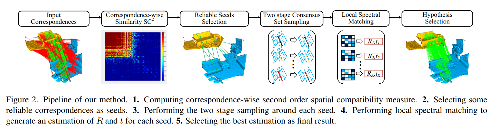

# SC^2-PCR++: A Second Order Spatial Compatibility for Efficient and Robust Point Cloud Registration (TPAMI)

PyTorch implementation of the paper:

[SC^2-PCR++: Rethinking the Generation and Selection for Efficient and Robust Point Cloud Registration](https://ieeexplore.ieee.org/document/10115040).

Zhi Chen, [Kun Sun](https://scholar.google.com/citations?user=Ay6kCm4AAAAJ&hl=en), Fan Yang, Lin Guo, [Wenbing Tao](https://scholar.google.co.uk/citations?user=jRDPE2AAAAAJ&hl=zh-CN&oi=ao).

## Introduction

Outlier removal is a critical part of feature-based point cloud registration. In this paper, we revisit the model generation and selection of the classic RANSAC approach for fast and robust point cloud registration. For the model generation, we propose a second order spatial compatibility (SC^2) measure to compute the similarity between correspondences. It takes into account the global compatibility instead of local consistency, allowing for more distinctive clustering between inliers and outliers at early stage. The proposed measure can promise to find a certain number of outlier-free consensus sets using fewer samplings, making the model generation more efficient. For the model selection, we propose a new Feature and Spatial consistency constrained Truncated Chamfer Distance (FS-TCD) metric for evaluating the generated models. It simultaneously considers the alignment quality, the feature matching properness and spatial consistency constraint, so that the correct model can be selected even if the inlier rate of the putative correspondence set is extremely low. Extensive experiments are carried out to investigate the performance of our method. In addition, we also experimentally prove that the proposed SC$^2$ measure and the FS-TCD metric are general and can be easily plugged into deep learning based frameworks.



## Requirements

If you are using conda, you may configure SC2-PCR as:

    conda env create -f environment.yml
    conda activate SC2_PCR
    
## 3DMatch

### Data preparation

Downsample and extract FPFH and FCGF descriptors for each frame of the 3DMatch test dataset. [PointDSC](https://github.com/XuyangBai/PointDSC) provides the pre-computed descriptors for the 3DMatch test set [here](https://drive.google.com/file/d/1zuf6NSD3-dHtTpk34iHtxAf8DQx3Y7RH/view?usp=sharing). Then download the ground truth poses from the [website of 3DMatch Benchmark](http://3dmatch.cs.princeton.edu/#geometric-registration-benchmark). The data should be organized as follows:

```
--data--3DMatch                
        ├── fragments                 
        │   ├── 7-scene-redkitechen/
        |   |   ├── cloud_bin_0.ply
        |   |   ├── cloud_bin_0_fcgf.npz
        |   |   ├── cloud_bin_0_fpfh.npz
        │   |   └── ...      
        │   ├── sun3d-home_at-home_at_scan1_2013_jan_1/      
        │   └── ...                
        ├── gt_result                   
        │   ├── 7-scene-redkitechen-evaluation/   
        |   |   ├── 3dmatch.log
        |   |   ├── gt.info
        |   |   ├── gt.log
        │   |   └── ...
        │   ├── sun3d-home_at-home_at_scan1_2013_jan_1-evaluation/
        │   └── ...                               
```

### Testing

Use the following command for testing.

```bash
python ./test_3DMatch.py --config_path config_json/config_3DMatch.json
```

The CUDA_DEVICE and basic parameters can be changed in the json file.

## 3DLoMatch

### Data preparation

FPFH and FCGF descriptors can be prepared in the same way as testing 3DMatch. If you want to test the [predator](https://github.com/prs-eth/OverlapPredator) descriptor, you should first follow the offical instruction of predator to extract the descriptors for 3DMatch dataset and organize the data as follows: 

```
--data--3DLoMatch                
        ├── 0.pth        
        ├── 1.pth                 
        ├── ...  
        └── 1780.pth
```

### Testing

Use the following command for testing.

```bash
python ./test_3DLoMatch.py --config_path config_json/config_3DLoMatch.json
```

## KITTI odometry

### Data preparation

Downsample and extract FPFH and FCGF descriptors for each frame of the KITTI test dataset. The raw point clouds can be download from [KITTI Odometry website.](http://www.cvlibs.net/datasets/kitti/eval_odometry.php). For your convenience, [here](https://drive.google.com/drive/folders/1sxkHYjWHhSUE3IcvmZ2p1ziw1LqJqqfc?usp=sharing) we provide the pre-computed FPFH and FCGF descriptors for the KITTI test set.

```
--data--KITTI                
        ├── fpfh_test                 
        │   ├── pair_0.npz        
        |   ├── pair_1.npz                
        |   ├── ...  
        |   └── pair_554.npz
        ├── fcgf_test                
        │   ├── pair_0.npz        
        |   ├── pair_1.npz                
        |   ├── ...  
        |   └── pair_554.npz
```

### Testing

Use the following command for testing.

```bash
python ./test_KITTI.py --config_path config_json/config_KITTI.json
```

## Results

### 3DMatch

We evaluate SC^2-PCR on the standard 3DMatch benchmarks:

|    Benchmark   | RR(%) | RE(°) |TE(cm) | IP(%) | IR(%) | F1(%) |
|:---------------|:-----:|:-----:|:-----:|:-----:|:-----:|:-----:|
|  3DMatch+FPFH  | 87.18 | 2.10  | 6.64  | 76.49 | 81.72 | 78.82 |
|  3DMatch+FCGF  | 94.15 | 2.04  | 6.50  | 80.57 | 87.69 | 83.71 |

### 3DMatch

We evaluate SC^2-PCR on the standard 3DLoMatch benchmarks:

|       Benchmark     | RR(%) | RE(°) |TE(cm) | IP(%) | IR(%) | F1(%) |
|:------------------------|:-----:|:-----:|:-----:|:-----:|:-----:|:-----:|
|      3DLoMatch+FCGF     | 61.15 | 3.72  | 10.56 | 47.12 | 56.52 | 50.85 |
|    3DLoMatch+Predator   | 71.59 | 3.45  | 9.61  | 59.61 | 70.17 | 63.73 |
| 3DLoMatch+GeoTransformer| 78.72 | 2.96  | 8.56  | 64.80 | 77.02 | 69.55 |

### KITTI odometry

We evaluate SC^2-PCR on the standard KITTI benchmarks:

|    Benchmark   | RR(%) | RE(°) |TE(cm) | IP(%) | IR(%) | F1(%) |
|:---------------|:-----:|:-----:|:-----:|:-----:|:-----:|:-----:|
|    KITTI+FPFH  | 99.64 | 0.32  | 7.19  | 94.07 | 96.19 | 95.00 |
|    KITTI+FCGF  | 98.56 | 0.32  | 20.61 | 82.17 | 91.23 | 86.09 |


## Citation

```bibtex
@article{chen2023sc,
  title={SC $\^{}$\{$2$\}$ $-PCR++: Rethinking the Generation and Selection for Efficient and Robust Point Cloud Registration},
  author={Chen, Zhi and Sun, Kun and Yang, Fan and Guo, Lin and Tao, Wenbing},
  journal={IEEE Transactions on Pattern Analysis and Machine Intelligence},
  year={2023},
  publisher={IEEE}
}
```

## Acknowledgements

- [PointDSC](https://github.com/XuyangBai/PointDSC)
- [FCGF](https://github.com/chrischoy/FCGF)
- [DGR](https://github.com/chrischoy/DeepGlobalRegistration)
- [PREDATOR](https://github.com/prs-eth/OverlapPredator)
- GeoTransformer(https://github.com/qinzheng93/GeoTransformer)

